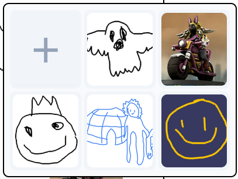

# Vedute Maker
###### Door Team Vedute 2
Begin dit schooljaar kregen wij, team Vedute2, een opdracht van [Vedute](https://vedute.nl/). Vedute is een kunstgemeenschap die opdrachten geeft aan kunstenaars om een ruimtelijk manuscript van 32x44x7cm te maken. Deze verzamelen in hun bibliotheek die zich bevind in het Depot Museum Boijmans Van Beuningen.
Vedute heeft echter een probleem. De aandacht naar Vedute wordt steeds minder, de doelgroep wordt ouder, en door de gelimiteerde aandacht komen ze niet in aanmerking voor subsidies en fondsen.
### Wie maakt de eerste digitale vedute?
Daar komt onze Vedute Maker in het plaatje. De Vedute maker is een ruimte waarin onze jonge doelgroep (gen-z) de ruimte krijgt om zich creatief te uiten binnen de context van Vedute. Zo laten we een jongere generatie kennis maken met vedute, en vergroten we Vedute’s kans op een subsidie.

### Painter’s Algorithm
Ruimte is ongelooflijk belangrijk voor het maken van een Vedute, ze hebben immers een standaar breedte, hoogte, en diepte. Daarom hebben we besloten dit te verwerken in ons project via het “Painter’s Algorithm”.
Het ‘Painter’s Algorithm is een manier om een ruimtelijke afbeelding te tekenen. Stel je voor dat je een landschap schildert: je begint met de bergen in de verte, voegt dan de dichterbij gelegen weilanden toe en schildert ten slotte bomen in de buurt.
Zo werkt de Vedute Maker ook. Je tekent eerst wat het verste weg is, daarna wat er in het midden staat, en als laatste wat er helemaal voor aan staat.
### Gif-ication
GIF's, die levendige fragmenten van leuke animaties, boordevol verzadigde kleuren, flitsende lichten en versnelde bewegingen, zijn één van de favoriete expressietalen van Gen Z geworden. In een digitaal tijdperk leggen deze geanimeerde clips emoties en reacties vast, een dynamische en visueel aantrekkelijke vorm van communicatie.
Daarom hebben we besloten GIF’s te verwerken in ons product. Als je je vedute hebt afgerond, wordt je beloont met een grappig clipje waar je de verschillende lagen ziet bewegen. Bewegende Vedute’s zijn leuk en makkelijk online te delen.

 
  
 

### P5.js Library
Om de gebruiker van een gemakkelijke teken- en edit ervaring te verzekeren, hebben we gebruik gemaakt van de P5.js library. Deze library is speciaal ontwikkeld voor creatieve doeleindes, en sluit goed aan bij ons project.
### Teken Opties
##### Kwast Aanpassingen
Gebruikers kunnen genieten van ons brede scala aan opties watbetreft kwasten.

##### Kleuren Selecteren
Onze Vedute Maker is uitgerust met een kleurmenu waarop alle kleuren op de regenboog beschikbaar zijn. Daarnaast krijgt de kunstenaar een pipet waarmee kleuren op je kunstwerk overnieuw gebruikt kunnen worden.

##### Afbeeldingen Toevoegen
De Vedute kunstenaar wordt niet gelimiteerd door eventuele lage illustratievaardigdheden, aangezien hen alle fotos op het internet en uit hen persoonlijk archief ter beschikking heeft! Deze kunnen gemakkelijk toegoevoegd worden doormiddel van de afbeeldingen-selector.

##### Lagen Selector
Doormiddel van de lagen selector zijn de 'Painter's Algorithm'-principes zonder enige moeite toe te passen.

##### Tutorial
Is de Vedute Maker niet duidelijk? Gelukkig is er een tutorial die je alles haarfijn uitlegt.

### Samenvatting van de code
###### Js bestanden

main.js: In dit bestand staat de code voor de meeste functionaliteiten, zoals het aanpassen van je Vedute. Dit zijn functionaliteiten zoals de kwasten, de kleuren, de grotes van de kwasten, het toevoegen van fotos, kleur selector, color picker etc, etc. 

tutorial.js: Door middel van deze tutorial weet de gebruiker precies waar die mee aan de slag kan.

popup.js: Deze code wordt gebruikt voor de pop-ups.

end.js: Deze code is voor nadat je je Vedute hebt afgerond.
### Onze developers
[Zino Schubert](https://github.com/1010115); Groepsleider, Ondernemende Technoloog

[Xander Koen](https://github.com/xanderkoen); Techlead, Betrokken Technoloog

[Youri de Gier](https://github.com/vultouri03); Ontwerpende Technoloog

[Dieuwe van Rijnswou](https://github.com/soapinmysight); Onderzoekende Technoloog

[Jens Verhoeff](https://github.com/JensV72); Ondernemende Technoloog

